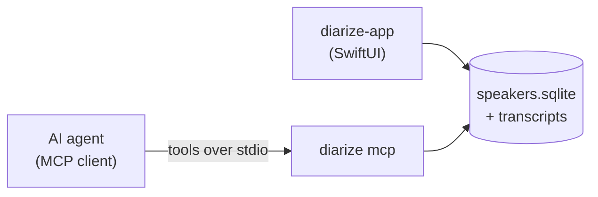

# MCP Server — Agent Access

diarize can expose your library to **local AI agents** through a [Model Context
Protocol](https://modelcontextprotocol.io) (MCP) server. Once connected, an agent can
read your recordings, speakers and folders, find the latest or unprocessed recordings,
mark them processed, retry failed analyses, and tidy up titles and folders — all by
calling tools, with no cloud access and no copy of your data leaving the machine.

It's the same engine as the app and CLI: the server talks directly to your local
speaker database, so what an agent sees is exactly what the app shows.

> **In one line:** `diarize mcp` turns your transcription archive into something an
> assistant can read and curate for you.

---

## When to use it

- Let an assistant **triage** new recordings — read transcripts, set meaningful titles,
  file them into folders.
- Build a **review workflow**: an agent processes each new recording, then marks it
  `processed` so it's skipped next time.
- **Recover** failed recordings — an agent reads the error message and retries analysis.
- Query your archive in natural language from any MCP-capable tool.

If you just want to script diarize yourself, the [CLI](cli.md) is the simpler path. The
MCP server is for handing controlled access to an *agent*.

---

## Starting the server

```sh
diarize mcp
```

The server speaks MCP over **stdio** (standard input/output) — the standard way local
agents connect. You normally don't run this by hand; instead you register the command
with your MCP client, which launches it on demand (see below).

It uses the same archive as everything else, resolved the usual way (`--archive` flag →
`DIARIZE_ARCHIVE_PATH` → config file → default). To point it at a non-default archive:

```sh
diarize mcp --archive ~/some/other/archive
```

---

## Connecting an agent

Most MCP clients are configured with a command to launch. Point them at the `diarize`
binary with the `mcp` subcommand.

**Claude Code:**

```sh
claude mcp add diarize -- /usr/local/bin/diarize mcp
```

**Generic MCP client** (e.g. an `mcp.json` / client config):

```json
{
  "mcpServers": {
    "diarize": {
      "command": "/usr/local/bin/diarize",
      "args": ["mcp"]
    }
  }
}
```

Use the full path to wherever you installed `diarize` (see [Install](../README.md#install)).
After connecting, the agent will discover all the tools listed below.

---

## How it fits together



The server and the app share the **same** local database. You can run an agent against
your library while the app is open and even while a recording is in progress — diarize
uses SQLite in WAL mode so reads and writes from both sides coexist safely. Changes an
agent makes show up in the app on its next refresh.

---

## What an agent can do

Tools are grouped by what they touch. Read tools never change anything; write tools are
marked, and the two irreversible ones are called out explicitly.

### Reading

| Tool | What it returns |
| --- | --- |
| `list_speakers` | Every known speaker (id, name, created date). |
| `list_folders` | All folders; nesting is described by each folder's `parentId`. |
| `list_recordings` | Recordings, **newest first**, with title, state, duration, folder, `processed` flag, and any `errorMessage`. Filterable — see below. |
| `get_recording` | Full metadata for one recording, including `hasAudio` and segment count. |
| `get_transcript` | The diarized transcript as structured segments — each with an `id`, time range, speaker id/label, text and ASR `confidence`. The `id` + `confidence` (and the text itself) are what an agent uses to judge and target diarization mistakes. |
| `recording_status` | Whether a recording is in progress right now, and which. |

**Filtering `list_recordings`** — combine any of:

- `limit` — how many to return (newest first; default 50).
- `processed` — `true` for only processed, `false` for only unprocessed.
- `state` — `recording`, `analyzing`, `done`, `empty`, or `failed` (use `failed` to find
  retry candidates).
- `folderId` — restrict to one folder (or root).
- `search` — full-text search across transcript segments.

### Writing

| Tool | Effect |
| --- | --- |
| `set_title` | Rename a recording. |
| `move_recording` | Move a recording into a folder (or to the root). |
| `create_folder` | Create a folder, optionally nested under a parent. |
| `rename_folder` | Rename a folder. |
| `set_processed` | **Bulk** set or clear the `processed` flag on one or more recordings. |
| `delete_folder` | ⚠️ Delete a folder. Child folders are deleted; recordings inside are **moved to the root**, not deleted. |
| `delete_audio` | ⚠️ **Irreversible.** Permanently delete a recording's raw audio while keeping its transcript and speaker data — the same [GDPR audio deletion](privacy.md#deleting-audio-keeping-the-transcript) the app offers. |

### Correcting diarization

An agent can read a transcript, spot where a speaker turn was attributed to the wrong person
(or where two people share one turn, or an unknown speaker is actually someone known), and fix
it. Each correction also re-renders the recording's `.md`/`.json` files so they stay in sync,
and segment/speaker reassignments **move the underlying voice embedding** too — so the speaker
matcher learns and future recordings get matched better.

| Tool | Effect |
| --- | --- |
| `reassign_segment` | Move a mis-attributed segment (by `id` from `get_transcript`) to the correct, existing speaker. |
| `create_speaker` | Create a new speaker — e.g. to attribute a voice that isn't a known speaker yet. |
| `rename_speaker` | Set or clear a speaker's name (e.g. name an `Unbekannt-…` speaker identified from the text). |
| `merge_speakers` | ⚠️ Merge two identities that are the same person: `from`'s segments + embeddings move to `into`, then `from` is deleted. |
| `split_segment` | Split one segment at a timestamp when it bundled two speakers; the new half can then be reassigned. |

Typical flow: `get_transcript` → notice an `Unbekannt-…` speaker is "Anna" → `rename_speaker`
it → `reassign_segment` any of her turns that were mis-attributed (or `create_speaker` first if
she's brand new). Use `split_segment` when one segment's text clearly switches speaker mid-turn.

### Retrying analysis

| Tool | Effect |
| --- | --- |
| `retry_analysis` | Re-run diarization + transcription on a recording (typically a `failed` one). |

Analysis is slow — it loads speech models and can run for minutes — so `retry_analysis`
**returns immediately** and the work continues in the background. An agent polls
`get_recording` until `processingState` becomes `done`, `empty`, or `failed`, reading the
fresh `errorMessage` if it fails again. Retries run one at a time. A recording whose audio
was already deleted can't be retried (there's nothing to analyze).

---

## The "processed" flag

Every recording carries a **processed** flag, off by default. It's there for *agent*
workflows — diarize itself never sets it. A typical loop:

1. `list_recordings` with `processed: false` → the backlog an agent hasn't handled yet.
2. The agent does its work (retitle, file, summarize — whatever you've asked of it).
3. `set_processed` with `processed: true` on those ids → they drop out of the backlog.

Because it's a normal field, you can also ask an agent to *re-open* items by clearing the
flag (`processed: false`).

---

## Resources

Alongside tools, the server publishes two read-only **resources** an agent can pull
directly:

- `diarize://status` — current recording status as JSON.
- `diarize://recording/<id>` — a recording's transcript as Markdown.

---

## Privacy & safety

- **Local only.** The server speaks over stdio to a process you launched; nothing is sent
  to a network. Your audio and transcripts never leave the Mac.
- **The agent gets full read/write access**, including the two destructive tools
  (`delete_folder`, `delete_audio`). Those tools are flagged as destructive so a
  well-behaved client can warn you before calling them — but the server itself doesn't ask
  for confirmation. Only connect agents you trust, and be deliberate about deletion.
- `delete_audio` is the same one-way door as in the app: the transcript stays, the audio
  is gone for good. See [Privacy & Data](privacy.md).

---

## Related

- [Command-Line Interface](cli.md) — the `diarize mcp` command and the rest of the CLI.
- [Privacy & Data](privacy.md) — on-device processing and audio deletion.
- [Documentation home](README.md)
